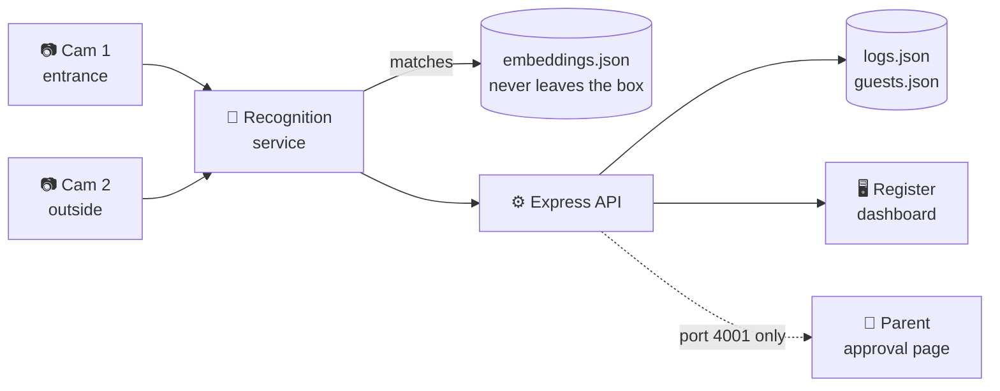
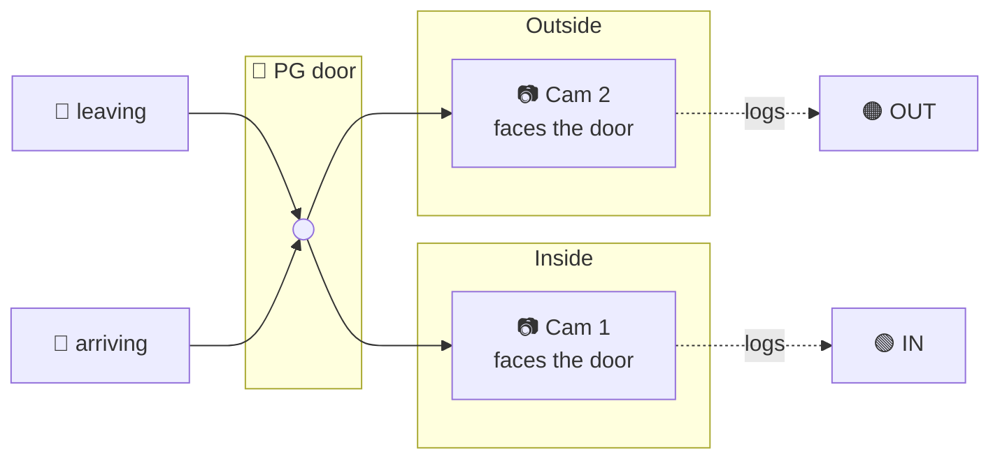
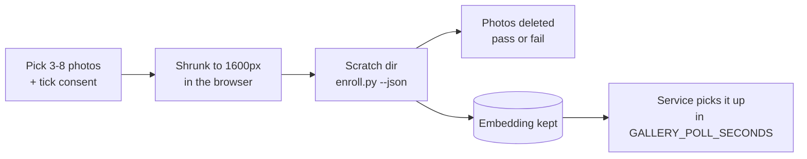
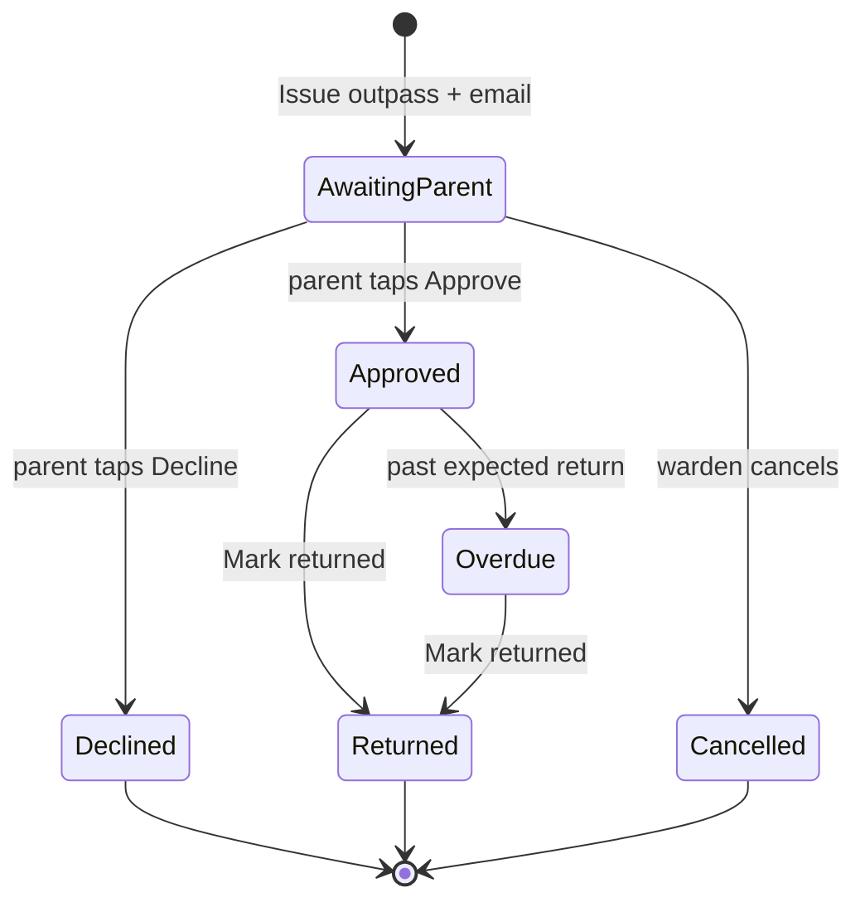
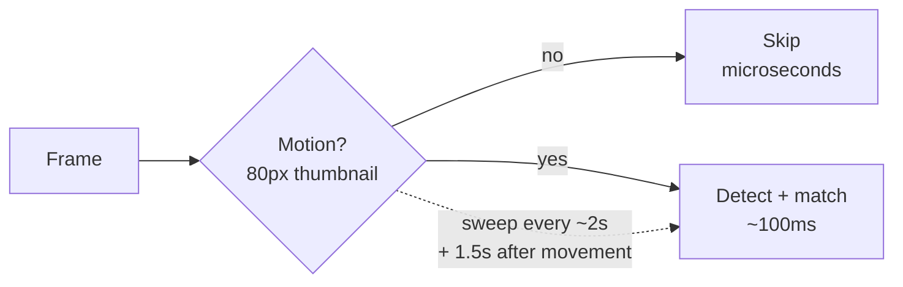
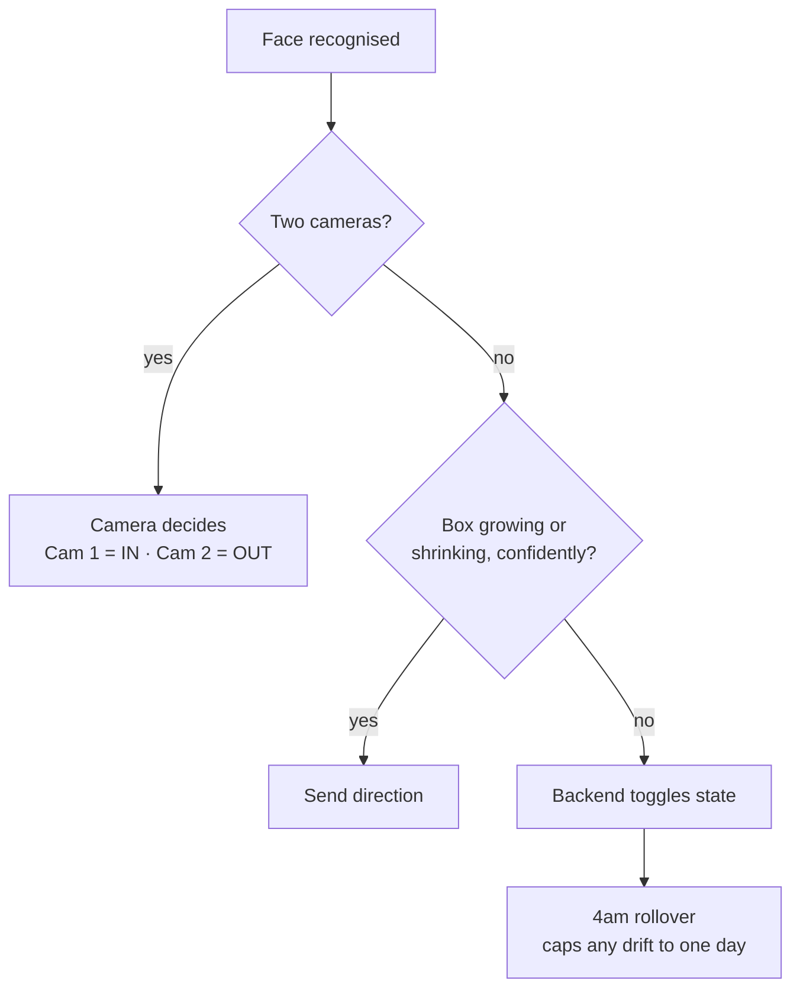

<div align="center">

# 🚪 GateLog

### Walk through the door. The register updates itself.

Face recognition replaces the paper sign-in book at a 20-guest PG.<br>
Two cameras, one mini PC, zero photos stored.

<br>


<br>


[Quick start](#-quick-start) · [Stages](#-bring-it-up-in-stages) · [Cameras](#-two-cameras) · [Dashboard](#-the-dashboard) · [Outpasses](#-outpasses) · [API](#-api) · [Tuning](#-tuning) · [Consent](#-hardware-and-consent)

</div>

<br>

  > Built on the **K.A.V.A.C.H** codebase. The flat JSON store, Express scaffold, app shell and dashboard/detail page layout carried over. The Gemini document-analysis flow did not.

---

## 🗺 How it fits together



---

## ⚡ Quick start

No camera needed. The register runs on fake data first, on purpose.

```bash
./setup.sh         # copy .env files, install backend + frontend deps
npm test           # backend, frontend time logic, recognition
npm run seed       # 20 fake guests and a day of movements
npm run dev:api    # terminal 1  →  http://localhost:4000
npm run dev:ui     # terminal 2  →  http://localhost:5173
```

> [!IMPORTANT]
> Use the **same `SERVICE_TOKEN`** in `backend/.env`, `recognition/.env` and `frontend/.env`, or manual entries come back 401.

> [!TIP]
> Don't install the recognition service until the register works on seeded data.

---

## 🪜 Bring it up in stages

Each stage works on its own. Don't move on until the one before it does.

| | Stage | You need | Command | You should see |
|:-:|---|---|---|---|
| **1** | Register logic | nothing | `npm test` | all tests green |
| **2** | API + dashboard | nothing | `npm run seed` · `dev:api` · `dev:ui` | a working register on fake data |
| **3** | Enrollment | reference photos | `python3 enroll.py --name … --photos …` | `--list` shows your guest |
| **4** | Recognition | a 30s phone clip | `python3 service.py --source clip.mp4 --no-post --window` | correct names and directions, printed |

<details>
<summary><b>Stage 3 in detail: enrolling someone</b></summary>

<br>

```bash
pip install -r recognition/requirements.txt
cd recognition
python3 enroll.py --name "Asha Kulkarni" --room 204 \
    --photos photos/asha/*.jpg --consent-given
python3 enroll.py --list
```

| Do ✅ | Don't ❌ |
|---|---|
| 3-5 photos, phone at arm's length | one photo only |
| indoor light | harsh backlight |
| one with glasses, one without | sunglasses |
| one with the head slightly turned | HEIC files (convert first) |

`enroll.py` rejects photos with no face, more than one face, a face under 110px, or visible blur. It warns if one photo looks like a different person from the rest.

Delete `data/*.json` (the fake data) **before** enrolling anyone real.

</details>

<details>
<summary><b>Stage 4 in detail: recognition against a recording</b></summary>

<br>

Film thirty seconds of people walking in and out, then run the command above. It prints what it *would* have logged. Fix names and directions on the clip first, then drop `--no-post` to go live.

`--window` needs a display and the non-headless OpenCV build. On a headless mini PC skip it and read the log lines, or open the dashboard's **At the Door** page.

</details>

---

## 📷 Two cameras



| | Camera | Job | Mount it… |
|---|---|---|---|
| 🟢 | **Cam 1** entrance | logs **in** | inside, looking at the door |
| 🟠 | **Cam 2** outside | logs **out** | on the far side, looking *back* at the door |

Direction comes from **which camera saw the face**, not from guessing. Someone who stops at the door or walks in at an angle is still logged correctly.

> [!WARNING]
> A face is only recognised when it points at the lens. A camera that merely faces *outward* sees arrivals face-on and logs them as leaving. If arrivals show up as exits, press **Swap cameras** or re-aim.

**The 8-second rule.** If the two views overlap, the second camera ignores a guest the first one just logged for `CROSS_CAMERA_SECONDS` (8). Otherwise someone stepping through the door could appear as "in", then "out" a second later.

**Swap cameras** (At the Door page) trades the two jobs. It's saved, takes effect in seconds, needs no restart, and drops any half-finished walk-past instead of mislabelling it.

<details>
<summary><b>Setting up a laptop camera + an external webcam</b></summary>

<br>

```bash
cd recognition
python3 list_cameras.py          # what answers
python3 list_cameras.py --show   # opens each, numbered (needs: pip install opencv-python)
```

Built-in is usually `0`, the webcam `1`. Then in `recognition/.env`:

```ini
CAMERA_1_SOURCE=0
CAMERA_2_SOURCE=1
```

Run `python3 service.py`, open **At the Door**, and you should see both pictures, Cam 1 on the left. Left one actually outside? Press **Swap cameras**, don't edit a file.

| Gotcha | What to do |
|---|---|
| One camera missing | The service starts with the other and notices it within `CAMERA_RETRY_SECONDS` (10) |
| "Has nothing there" | Close Teams, Zoom, Windows Camera, any browser tab using it |
| Laptop struggling | `CAMERA_WIDTH=1280` `CAMERA_HEIGHT=720`, then lower `MAX_FPS` |
| Want one camera again | Delete the two `CAMERA_n_SOURCE` lines, set `CAMERA_SOURCE` |

Dry run with two recordings:

```bash
python3 service.py --source in.mp4 --source2 out.mp4 --no-post --window
```

</details>

---

## 🖥 The dashboard

Six tabs across the top: **Live Dashboard**, **At the Door**, **Guest List**, **Outpass**, **Add a Guest**, **Unknown Faces**. A green *Register online* dot, the clock, and **Manual Override** sit in the header on every page.

### Live Dashboard
Who's in, who's out, and the entrance camera, all on one screen. Refreshes itself every 5 seconds.


Anyone not seen since the 4am rollover shows as **IN (assumed)**, because everyone is home at 4am. A real camera reading replaces that with a time and a match score.

### At the Door
Both cameras side by side, each labelled with its current job (`marks IN` / `marks OUT`). **Swap cameras** and the live view switch are top right.


Here the view is switched off to spare the mini PC. The banner says it plainly: the cameras are still watching and the register is still filling in.

### Add a Guest
Name, room, optional phone, 3-8 photos and the consent tick. Enrolled guests are listed alongside.


### Outpass
Pick a student, confirm the parent's email, and press **Send request to parent**. Open passes show their status underneath.


The full flow, including the email the parent receives and the slip you print, is covered under [Outpasses](#-outpasses).

### Guest detail
Exits in the last 7 days, average time away, last seen, and a full movement timeline with the camera and match score behind each entry.


The orange **REPEAT DIRECTION** tag marks a second "in" with no "out" between, a sign that a movement was probably missed.

### Unknown Faces
Faces the matcher saw but wouldn't name, with near-misses flagged against the threshold.


Follows the **GateLog** design from the Stitch export: dark tonal surfaces, 🔵 cyan for telemetry, 🟢 emerald for *in*, 🟠 amber for *out*. The tokens in `frontend/tailwind.config.js` come straight from its `DESIGN.md`. Fonts and icons are served from npm, so it works on a PG network with no internet.

<details>
<summary><b>What was left out of the mockups, and why</b></summary>

<br>

Anything the register has no real data for is **left out, not faked**: curfew and compliance, capacity ("20 / 20 Max"), floor names, guardian contacts, gate buzzer and emergency lock, "neural weights" and AES-256 claims, PDF export, profile editing, guest photos.

The register never stores a photograph, so avatars are initials. Match scores are raw cosine similarity (`0.62`), not percentages. "98.4%" would imply a certainty the number doesn't carry.

</details>

**Manual override** opens from the header, a guest's page, the dashboard drawer, or `/log`. It can back-date an entry to *earlier today*, never before the 4am rollover and never into the future. `POST /api/logs` returns 400 for an unparsable or future `timestamp`.

### ➕ Adding and removing guests



No restart, no terminal. The model load takes tens of seconds (minutes on the very first run), so the page polls a job instead of hanging.

**Removing:** on Guest List, press and hold (or tap **Select**), tick guests, press **Remove**. Face data is deleted, past movements stay. From a terminal:

```bash
python3 enroll.py --keep-record --remove <id> <id> ...
```

---

## 📧 Outpasses



Top bar → **Outpass** (or **Issue Outpass** on a guest's page): pick the student, confirm the parent's email, set reason, destination and leaving time (expected return and a note are optional). The email shows the student, destination, reason, times and pass number.

- One open pass per student
- **Print** gives a slip for the gate. It says APPROVED, DECLINED or Awaiting, never more than the parent said
- If the email fails, the pass is still issued and the page says why
- First answer is final. Buttons expire after `APPROVAL_TTL_HOURS` (72) or when you cancel. **Resend request** gives a fresh window

> [!NOTE]
> Each button opens a page with one confirm tap. That's deliberate: mail scanners open every link, so a link that decided on open would answer before the parent read anything.

### 📨 What the parent sees

The parent gets an email with the student, destination, reason, leaving time and pass number, plus one-tap **Approve** and **Decline** buttons. The email also states how long the buttons stay valid and gives the PG's contact number in case the parent wasn't expecting the request.

<div align="center">


</div>

### 🖨 The printed slip

Once the parent has answered, **Print** produces a slip for the gate. It records the parent's decision and the time they gave it, and leaves signature lines for the warden and the student.

<div align="center">


</div>

<details>
<summary><b>Email setup</b></summary>

<br>

In `backend/.env`, then `cd backend && npm install` and restart the API:

```ini
SMTP_HOST=smtp.gmail.com
SMTP_PORT=465
SMTP_USER=you@gmail.com
SMTP_PASS=<16-letter App Password>
PG_CONTACT=+91 98xxxxxxx
```

Gmail needs an **App Password** (Google Account → Security → 2-Step Verification → App passwords). Your normal password is refused.

Leave `SMTP_HOST` empty and nothing is sent. Each email is saved to `data/outbox/` as a text file, the safe way to try it.

</details>

<details>
<summary><b>Letting a parent's phone reach the approval page</b></summary>

<br>

`localhost:4001` won't open on a phone. Give port **4001** a public address, and **only 4001**. Never 4000, which lists every student. Then set `PUBLIC_URL=https://...` in `backend/.env` and restart.

Quickest free route, a Cloudflare quick tunnel:

```bash
winget install Cloudflare.cloudflared
cloudflared tunnel --url http://localhost:4001
```

Quick-tunnel addresses change on every start, and old emails stop working when they do. For a fixed address use a named Cloudflare tunnel or any host that forwards to 4001. Until `PUBLIC_URL` is set, the Outpass page shows a warning and the buttons only work on the register's own computer.

**Why it's safe:** each pass has a private random token that exists only in that parent's email and is never returned by the dashboard API. The approval pages run on their own port in a separate app that can reach nothing else. Wrong ids and wrong tokens get the same generic page.

</details>

---

## 🔌 API

| | Path | What for | 🔑 |
|:-:|---|---|:-:|
| `GET` | `/api/health` | is the box up | |
| `GET` | `/api/summary` | register header, service-health dot | |
| `GET` | `/api/guests` · `/api/guests/:id` | list, detail | |
| `POST` | `/api/guests/remove` | `{ ids: [...] }` deletes face data, keeps history | ✅ |
| `GET` | `/api/logs` | `?date= &guest_id= &limit=` | |
| `POST` | `/api/logs` | recognition + manual entry | ✅ |
| `GET` `POST` | `/api/unknown` | unknown faces | POST ✅ |
| `GET` | `/api/outpasses` | `?status=issued` `?guest_id=` | |
| `POST` | `/api/outpasses` | issue + email parent | ✅ |
| `POST` | `/api/outpasses/:id/resend` | send again | ✅ |
| `POST` | `/api/outpasses/:id/close` | `{ status: "returned" \| "cancelled" }` | ✅ |
| `GET` `POST` | `/api/parents/:guest_id` | saved parent contact | POST ✅ |
| `GET` `POST` | `/outpass/respond` | **port 4001 only.** Parent's page, authorised by pass token | |
| `GET` `POST` | `/api/cameras` | which is entrance / outside, Swap button | POST ✅ |
| `POST` | `/api/preview` | service sends a door frame (`cam`) | ✅ |
| `GET` | `/api/preview?cam=1\|2` | door screen. Asking keeps that feed alive | |
| `GET` `POST` | `/api/preview/state` | does anyone watch? / live view switch | POST ✅ |
| `POST` | `/api/enroll` | Add a guest form | ✅ |
| `GET` | `/api/enroll/:jobId` | poll the job | |

🔑 = needs `SERVICE_TOKEN`. **`embeddings.json` has no route.** The API never reads it.

> [!CAUTION]
> `GET /api/preview` is open, like every other GET. The API is meant for a trusted LAN behind `CORS_ORIGIN`, but a live picture of your doorway is more sensitive than a list of room numbers. If the PG wifi is shared with guests, put the token on the GETs too, or keep the dashboard on a separate network.

---

## 🔋 What it costs the mini PC

Face detection is the expensive bit: about **100ms a frame** on an N100. Two things keep it cheap.



| | What | Saves |
|---|---|---|
| 🎯 **Motion gate** | No movement, no detection. Still sweeps every couple of seconds so a motionless person is never invisible | a clip ~4% occupied needs **80% fewer detections** with identical register output. A real doorway is idle far longer |
| 👁 **Live view on demand** | Frames are only encoded if a browser asked in the last 10s | the JPEG encode and network. Real but small, single-digit percent |

The service prints the share of skipped frames every 300 frames. Watch that number.

Still struggling? Pull these levers in order: `MAX_FPS` → `MODEL_PACK=buffalo_s` → `DETECT_WIDTH`.

---

## 🧭 How it decides things



With one camera, the first plan toggled on every sighting. One missed recognition then inverted that guest's entries forever, silently. Tracking the face box fixes most of it, and the 4am reset (`DAY_RESET_HOUR`) bounds the rest. Set `APPROACH_MEANS=out` if your single camera watches people leaving. When the same direction repeats for a guest, the timeline tags it **REPEAT DIRECTION** so a missed movement is visible instead of silent.

<details>
<summary><b>Liveness: opt-in, and why it's off</b></summary>

<br>

KAVACH's liveness check is challenge-based (blink, turn on cue), which doesn't suit someone walking past. What's wired in instead (`core.check_liveness`) is a coarse passive filter:

| Rejects | Because |
|---|---|
| too blurry | printed or low-quality source |
| flat chroma | screen replay |
| too much glare | print or screen catching light |

Rejections go to `/api/unknown` with a `liveness_*` reason. It is **not** a real anti-spoofing model and won't stop a good print or a high-end replay. The attack it covers (holding up a printed photo of a housemate) is narrow here, and it costs a colour crop per observation plus some false rejections.

Turn it on with `LIVENESS_ENABLED=1`, then tune `LIVENESS_BLUR_FLOOR`, `LIVENESS_CHROMA_LOW` / `HIGH` and `LIVENESS_GLARE_CEILING` against your own footage.

</details>

---

## 🎚 Tuning

| Setting | Default | Meaning |
|---|:-:|---|
| `MATCH_THRESHOLD` | `0.42` | cosine similarity floor |
| `MATCH_MARGIN` | `0.06` | how far the best guest must beat the runner-up |

Run a week with `LOG_UNKNOWNS=1` and watch the unknown faces page.

| You see | Fix |
|---|---|
| lots of rejections just above the threshold | lower it, or re-enroll with better photos |
| wrong names in the register | raise the threshold, widen the margin |

Missing a guest is cheap. A wrong name in the register is not. **When in doubt, err high.**

`VITE_MATCH_THRESHOLD` only shades the unknown faces page. The real threshold is the recognition service's, so keep the two in step.

<details>
<summary><b>Door screen stays blank?</b></summary>

<br>

`service.py` reads `recognition/.env` on start (real env vars win). The log line `read N settings from .env` means it found the file.

If you see `the register rejected our SERVICE_TOKEN`, the token differs from `backend/.env`. Fix it and restart both. Movements queue on disk meanwhile instead of being dropped.

</details>

---

## 🛠 Hardware and consent

| | Decision | Why |
|---|---|---|
| 📷 | **Camera**: 1080p covering a 1.2m doorway from 2-3m | a face needs ~80-100px across. Backlight is the killer: a camera inside pointing at a bright doorway silhouettes everyone. IP camera → set `CAMERA_SOURCE` to its RTSP URL; USB → the index |
| 🧠 | **InsightFace on ONNX Runtime**, not `dlib` | pip-installs without a compiler, and handles off-angle, motion-blurred doorway frames better. Need `face_recognition` anyway? Only the embedding call in `core.py` changes |
| ⏱ | **No OpenVINO yet** | detection is the bottleneck, not 20 faces. Run plain `onnxruntime` first. Only if the logged fps is under ~6, switch to `onnxruntime-openvino` or `buffalo_s` |

### 📜 Consent

> [!IMPORTANT]
> Face embeddings of twenty residents are **biometric data under the DPDP Act**. Get written consent at move-in and keep it with the tenancy paperwork. Decide this now, not after twenty people are enrolled.

`enroll.py` refuses to run without `--consent-given`, and `--remove` deletes a guest's face data when they move out.

---

<details>
<summary><b>📁 Project layout</b></summary>

<br>

```
recognition/
  core.py              matching, tracking, direction, camera roles, motion gate (no I/O)
  test_core.py         32 tests, no camera or model
  test_service.py      17 tests of the whole camera loop, OpenCV + model stubbed
  list_cameras.py      which camera number is which
  enroll.py            add a guest, or --remove. --json for the dashboard
  service.py           the always-on camera loop

backend/
  server/db.js              flat JSON store: toggle, day rollover, idempotency
  server/index.js           REST API
  server/live-view.js       one frame per camera in memory, with backpressure
  server/cameras.js         entrance vs outside (the Swap button)
  server/enroll-jobs.js     runs enroll.py for Add a guest
  server/guest-removal.js   runs enroll.py --remove
  server/outpass.js, mailer.js
  server/public-server.js, approval-page.js    parent pages, own port
  scripts/seed-demo.js      fake data
  tests: db 17 · routes 14 · live-view 28 · outpass 25 · guest-removal 7

frontend/
  src/pages/        Register, DoorCamera, AddGuest, GuestList, GuestDetail,
                    UnknownFaces, OpenOverride (keeps /log working)
  src/components/   AppLayout, StatusBits, OverrideModal, OverrideContext
  src/api.js · time.js · App.jsx · index.css

docs/screenshots/   README images (dashboard, door, add-guest, outpass,
                    guest-detail, unknown, parent-email, outpass-printed)

data/               guests · embeddings · logs · unknown  (.json, gitignored)
setup.sh            first-run setup, safe to re-run
```

`embeddings.json` is biometric data for real people. It must never reach a remote.

</details>

<div align="center">
<sub>Descended from K.A.V.A.C.H, an identity-document forgery detection project. Same bones, different door.</sub>
</div>
